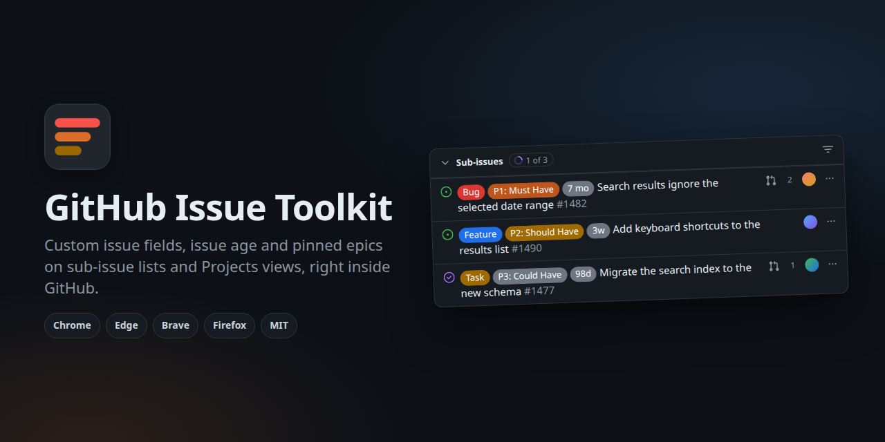
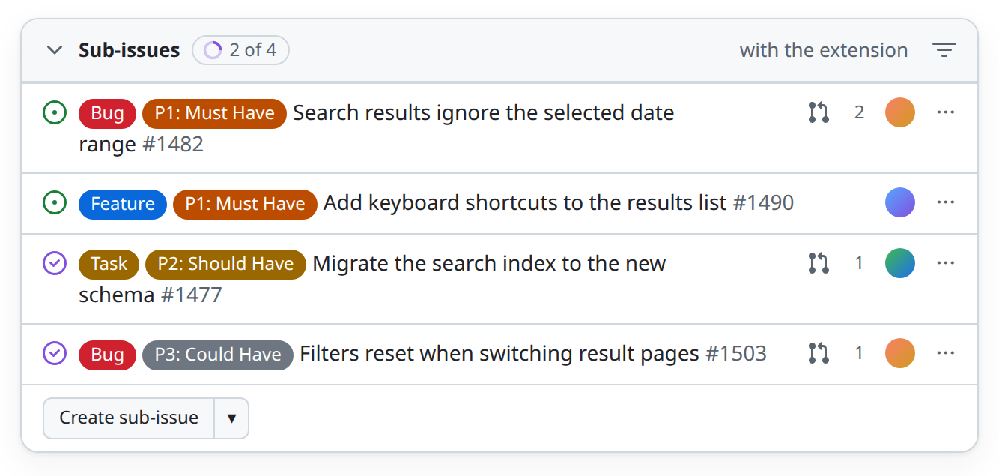
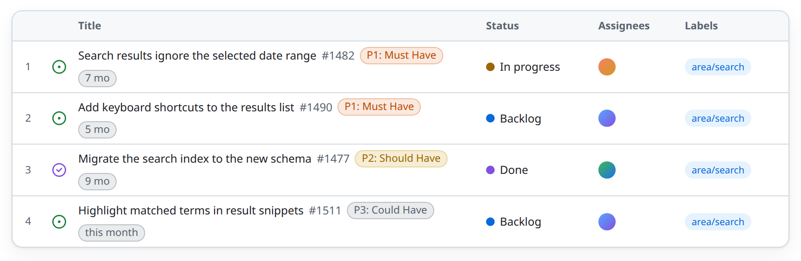
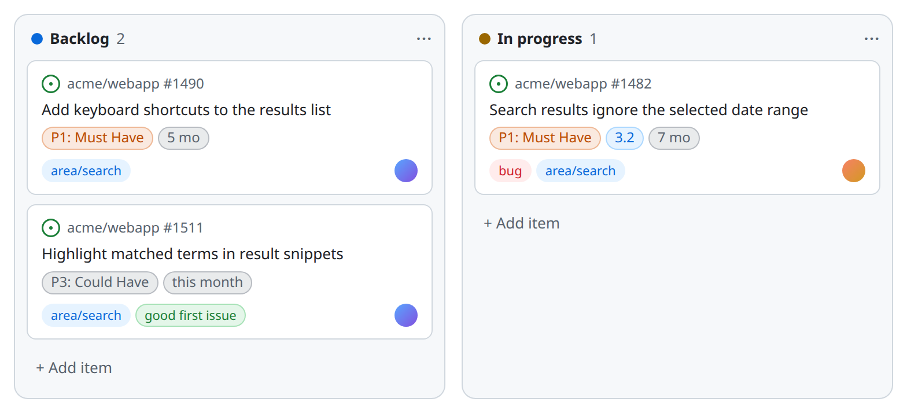
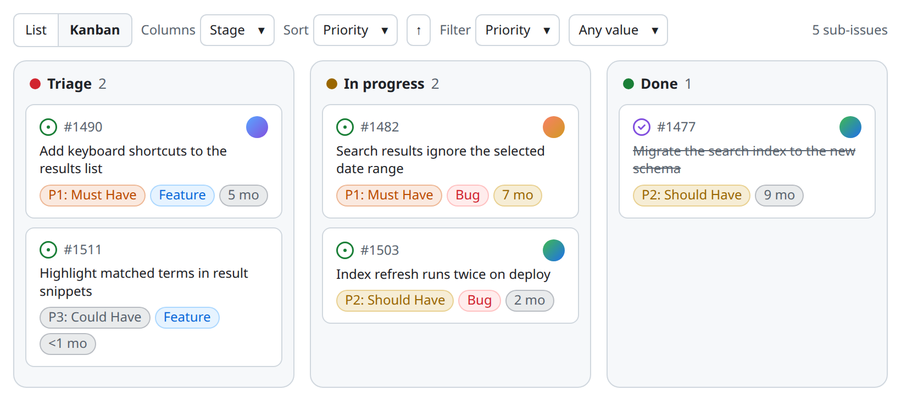
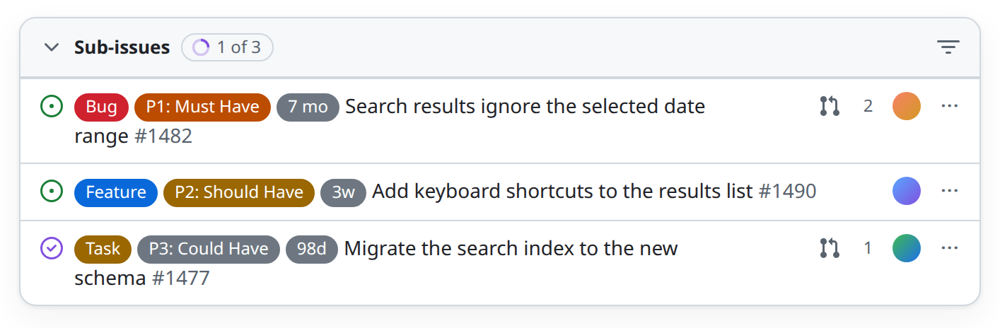
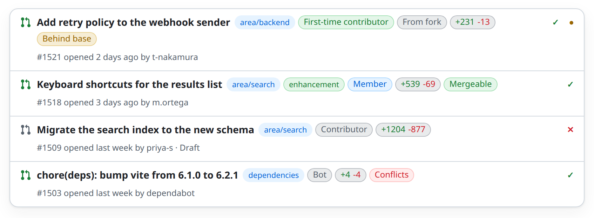
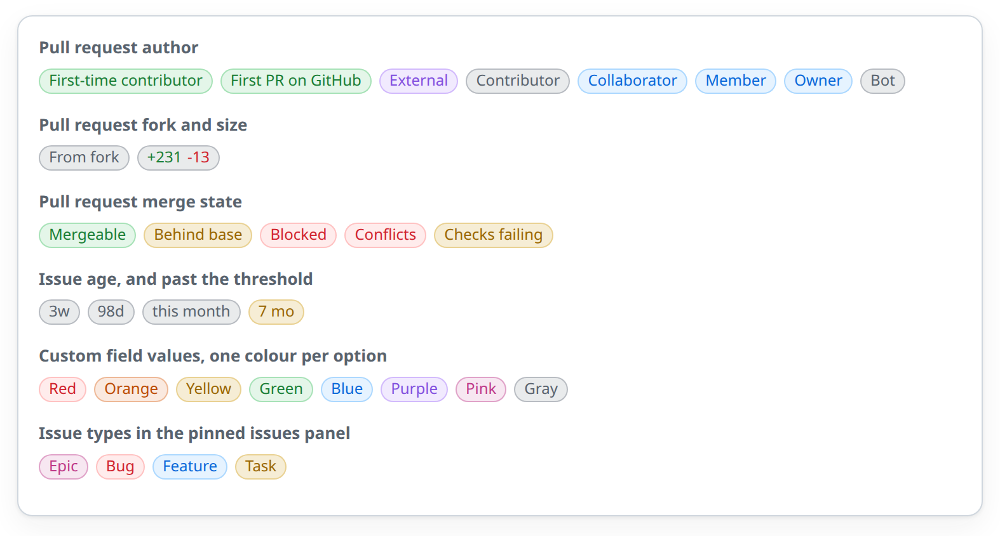
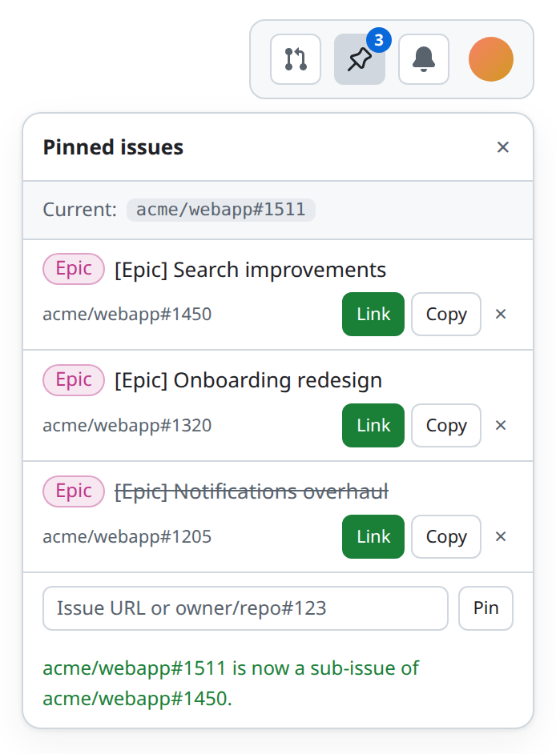

# GitHub Issue Toolkit

[Documentation site](https://milospaunovic.github.io/github-issue-toolkit/) · [Releases](https://github.com/MilosPaunovic/github-issue-toolkit/releases) · [Changelog](CHANGELOG.md) · [Privacy](PRIVACY.md)

Browser extension that shows the values of your organization's custom GitHub **issue fields** as badges on every row of the **Sub-issues** list of an issue and on **Projects** views (table and board), plus the **age** of each issue and **pull request** badges that tell you who is behind each PR. An epic's sub-issues can be read as a **kanban board** grouped, ordered and filtered by the fields you choose, where dragging a card writes the new value back, and a small **Pinned issues** panel keeps your epics one click away so you can link the issue you are looking at to them. Works in Chrome, Edge, Brave and other Chromium browsers, and in Firefox.

GitHub itself only shows the issue type there. This extension reads the field values through the GitHub GraphQL API, in batched queries covering all visible rows, across repositories. Everything is read-only except two things you do yourself: linking an issue to a pinned epic, and dragging a card to another column on the kanban board, both of which write through the same API.

## What it looks like

Illustrations of an invented repository, rendered from the documentation site with `scripts/render-examples.py`, using a field named Priority as the example.

**Sub-issues list**: one badge per configured field, right after the issue type.

<picture>
  <source media="(prefers-color-scheme: dark)" srcset="docs/example-sub-dark.png">
  
</picture>

**Projects table view**: badges follow the issue number in the title cell.

<picture>
  <source media="(prefers-color-scheme: dark)" srcset="docs/example-table-dark.png">
  
</picture>

**Projects board view**: badges sit under the card title.

<picture>
  <source media="(prefers-color-scheme: dark)" srcset="docs/example-board-dark.png">
  
</picture>

**Epic kanban**: a List and Kanban toggle above the sub-issues list turns an epic into a board; you pick the field that forms the columns, the field that orders the cards inside each column, and a value to filter the whole board down to. Dragging a card to another column writes the new field value, or closes and reopens the issue.

<picture>
  <source media="(prefers-color-scheme: dark)" srcset="docs/example-kanban-dark.png">
  
</picture>

**Issue age** (optional, off by default): a gray badge with the time since the issue was created, in months, weeks or days; yellow once the issue is older than the threshold, 90 days by default.

<picture>
  <source media="(prefers-color-scheme: dark)" srcset="docs/example-age-dark.png">
  
</picture>

**Pull request list**: the author's relation to the repository, and optionally fork origin, size and merge state, among the labels of each row.

<picture>
  <source media="(prefers-color-scheme: dark)" srcset="docs/example-pulls-dark.png">
  
</picture>

**Every badge at a glance**: what each colour means across all features.

<picture>
  <source media="(prefers-color-scheme: dark)" srcset="docs/example-palette-dark.png">
  
</picture>

**Pinned issues**: a pin button next to the notifications bell opens your pinned epics; Link makes the current issue a sub-issue of one, Copy copies its reference.

<picture>
  <source media="(prefers-color-scheme: dark)" srcset="docs/example-pins-dark.png">
  
</picture>

## Features

- Badges appear next to the issue type on each sub-issue row, in the option's colour.
- The same badges appear on GitHub Projects views: after the issue number in the table layout, under the title on board cards. Fields the view already shows are skipped so nothing appears twice: a column, a card field, or the field a board is grouped by (can be turned off in the settings).
- An optional **age** badge shows how old each issue is, in months (`3 mo`), weeks or days, and turns yellow once an issue has been open longer than a threshold you choose (90 days by default). Off by default.
- **Pull request badges** on the pull request list and on Projects views that contain pull requests: the author's relation to the repository (first-time contributor, external, contributor, collaborator, member, bot) on by default, plus optional badges for forks, size (added lines in green, removed in red) and merge state.
- An **epic kanban**: above the sub-issues list of an issue, a List and Kanban toggle draws those sub-issues as a board. The columns come from any field the sub-issues carry (or their state, type or assignee), the cards inside a column are ordered by another, and a filter keeps one value of a third; every choice is remembered. Dragging a card to another column writes the field value back to GitHub, or closes and reopens the issue. Both the board and the dragging can be switched off in the settings.
- A button that **hides the issue sidebar**: one press folds away the whole metadata column, assignees, labels, type, fields, projects and the rest, and gives the issue body and the board that width. The button sits in the gutter between the two, so it does not move when the sidebar goes, and what you chose holds on every issue. Can be switched off in the settings.
- A **Pinned issues** button in GitHub's top bar: pin epics, copy their reference, or make the issue you are looking at a sub-issue of a pinned epic with one click. Can be switched off in the settings.
- Any field type works: single-select, multi-select, text, number, date.
- Choose which fields to show and in what order; nothing is shown until you pick at least one field or enable the age badge.
- One API request per page, results cached for five minutes, no polling.
- Light and dark theme, follows GitHub's own colour tokens.
- No analytics, no third-party services. See [PRIVACY.md](PRIVACY.md).

## Install

The extension is plain files with no build step, so "installing from source" means pointing the browser at the folder. It runs in every Chromium-based browser and in Firefox.

### Chrome, Edge, Brave, Opera, Vivaldi, Arc (Chromium)

1. Clone or download this repository.
2. Open the extensions page: `chrome://extensions` (Edge: `edge://extensions`, Brave: `brave://extensions`, Opera: `opera://extensions`, Vivaldi: `vivaldi://extensions`) and enable **Developer mode**.
3. Click **Load unpacked** and select the repository folder.
4. Click the toolbar icon (or Details > Extension options) to open the settings.

### Firefox

Firefox does not run extension service workers and treats site access as an optional permission, so it uses its own manifest (`manifest.firefox.json`) and asks once for access to `github.com`.

1. Run `scripts/package.sh` to build `github-issue-toolkit-<version>-firefox.zip`, or download it from the releases page.
2. Open `about:debugging#/runtime/this-firefox`, click **Load Temporary Add-on**, and pick the zip. Temporary add-ons are removed when Firefox restarts; a permanent install needs a package signed by Mozilla.
3. Open the settings from the toolbar icon. If a **Site access** box is shown, click **Allow access to github.com**. Firefox may also show the request on the extensions (puzzle) button.

Minimum version: Firefox 140, required by the `data_collection_permissions` manifest key.

### Other browsers

- **Safari** needs Apple's `xcrun safari-web-extension-converter`, an Xcode project, and an Apple developer account. Not provided.
- Any other browser that implements Manifest V3 WebExtensions should work with one of the two manifests; the code uses the `browser` namespace when present and falls back to `chrome`.

## Setup

1. Create a GitHub personal access token:
   - **Classic** (recommended): https://github.com/settings/tokens/new with the `repo` scope. If the organization enforces SSO, click "Configure SSO" next to the new token and authorize it for the organization.
   - **Fine-grained**: https://github.com/settings/personal-access-tokens/new. Set the organization as resource owner, pick the repositories, and under Repository permissions set `Issues` to `Read-only` (or `Read and write` if you want to link issues to pinned epics from the panel, or drag cards on the kanban board).
2. Paste the token on the settings page, click **Test token**, then **Save**.
3. Add the **Field names** to show: each field is a chip, press Enter or comma to add one, Backspace or the × button to remove one. Names are matched case-insensitively. No badges appear until at least one field is added or the age badge is enabled.
4. Optionally enable the **Issue age** badge (off by default), pick its unit and the age after which it turns yellow (90 days by default), choose which **Pull request** badges you want (author relation on by default; fork, size and merge state off), and decide whether you want the **Epic kanban** toggle, dragging cards on it, the button that hides the **Issue sidebar**, and the **Pinned issues** button in GitHub's top bar (all on by default).
5. Open any issue with sub-issues, or a project view such as `https://github.com/orgs/<org>/projects/<n>/views/<v>`.

### Epic kanban

An issue that has sub-issues gets a **List** and **Kanban** toggle above the list. Kanban replaces the list with a board of the same sub-issues, read in one query with every field value they carry, so the board can group by a field you never added to the badge list.

- **Columns** picks what forms the columns: any field the sub-issues carry, or their state, type or assignee. A single-select field's columns follow the order the organization gave its options, and keep the empty ones when there are ten or fewer, so a stage nothing sits in is still visible. Issues without a value land in a last column, for example `No Stage`.
- **Sort** picks what orders the cards inside each column: the issue number, the creation date, the title, the state, the type, the assignee or any field; the arrow button flips the direction. Items with no value for the sort field stay at the bottom either way.
- **Filter** keeps one value of any of those same dimensions, so you can read a single sprint or the P1 issues alone. The count in the toolbar then says how many of the epic's sub-issues are left, and the columns stay as they are. Filtering happens in the page, with no extra request.
- **Dragging** a card to another column moves it, when the columns come from a single-select field or from the issue state: the field value is written with `createIssueFieldValue`, the "No <field>" column clears it with `deleteIssueFieldValue`, and the state columns use `closeIssue` and `reopenIssue`. The card moves first and slides back with the reason in the toolbar if GitHub refuses. Columns made of types or assignees are not drop targets. This is the only part of the board that writes, it needs a token with write access, and the whole behaviour can be switched off in the settings.
- Each card shows the issue state, its number, its assignees, the title and the badges for your configured fields, the issue type and the age when enabled. The field that forms the columns is not repeated on the cards.
- Both choices and the toggle itself are remembered across issues and tabs. Up to 500 sub-issues are loaded, in pages of 100; beyond that the toolbar count says how many of the total are shown.
- Apart from a card you drag yourself, the board only reads. A change made elsewhere shows up once the five-minute cache expires or the page is reloaded.

### Issue sidebar

A small chevron in the gutter between an issue and its sidebar hides the metadata column: assignees, labels, type, the custom fields, projects, milestone, everything. The issue body and the kanban board take the freed width, GitHub's own layout does the reflowing, and the button stays where it was so pressing it again brings the sidebar back.

- The choice holds on every issue and in every tab until you press the button again.
- On a narrow window, where GitHub already stacks the sidebar under the issue instead of beside it, the button is not shown; there is nothing to gain there.
- The whole thing can be switched off on the settings page.

### Pinned issues

A pin button sits in GitHub's top bar, next to the notifications bell, with the number of pinned issues. It opens the pinned issues panel as a dropdown; clicking outside or pressing Escape closes it, and the open or closed state is per tab. On pages without the GitHub header a small floating pin button in the top right corner takes its place. A red dot on the button means the last request failed (for example no token yet); open the panel to read the message. The whole feature can be switched off in the settings.

- **Pin it** pins the issue you are looking at: the current issue page, or the item open in the project side panel. You can also paste an issue URL or `owner/repo#123` and press **Pin**.
- Each pin shows its type (for example `Epic`) and title, and has three actions: **Link** makes the current issue a sub-issue of the pin (asks before moving an issue that already has a different parent), **Copy** copies `owner/repo#123` to the clipboard, and **×** unpins it.
- Pins are stored locally in the browser and shared across tabs. The settings page can remove them all.

Linking calls GitHub's `addSubIssue` mutation and needs a token with write access to the issue's repository. Classic tokens with the `repo` scope have it; fine-grained tokens need `Issues: Read and write`.

Fields with "Organization only" visibility are returned only for tokens that belong to an organization member.

The token is stored with `chrome.storage.local` on your device and is only ever sent to `https://api.github.com/graphql`.

## How it works

- `content.js` watches the page for sub-issue lists, project table rows (`role="rowheader"` cells), board cards and pull request list rows, collects the issue and pull request links, and asks the background script for the field values, creation dates and pull request details.
- `background.js` groups the issues by repository and runs one GraphQL query per batch of 60 issues using `Issue.issueFieldValues` and `createdAt`, then returns only the configured fields. Without a token or without anything to show it answers with a hint that `content.js` shows above the sub-issues list or in the pins panel. For pull requests it reads `authorAssociation`, whether the head is a fork, additions, deletions, changed files and `mergeStateStatus`. It also resolves pinned issues (title, type) and runs the `addSubIssue` mutation. It runs as a service worker on Chromium and as an event page on Firefox.
- `content.js` renders a badge per value after the issue type badge (or after the issue number in project tables, under the title on board cards), plus the age badge, styled by `content.css` with GitHub's colour tokens. It also renders the pinned issues panel; the current issue is taken from the page URL or from the `issue=owner|repo|number` parameter GitHub adds when a project side panel is open.
- The kanban has its own path: `background.js` reads the open issue's `subIssues` connection, paginated by 100 up to 500 sub-issues, returning every field value each one carries plus its state, type, assignees and creation date. `content.js` groups, orders and filters those in the page and draws the board in place of the list, so changing any of the three redraws without another request. A dropped card is the exception: it writes through `createIssueFieldValue`, `deleteIssueFieldValue`, `closeIssue` or `reopenIssue`, updating the board first and reverting it if the write fails. The result is cached per epic like everything else.
- The sidebar button is a small rail `content.js` inserts between GitHub's content area and its metadata column, both flex items of the same row. Collapsing sets `display: none` on the metadata column, which is what GitHub itself does when its artifacts panel opens, and its content area grows into the space on its own.
- `options.html` / `options.js` provide the settings page, including the one-time site-access prompt Firefox needs.
- All scripts start with `const api = browser ?? chrome`, so the same code runs on both engines.

## Development

No build step. Edit the files, then reload the extension (Chromium: reload icon on the extension card; Firefox: **Reload** on `about:debugging`).

- `manifest.json` is the Chromium manifest, `manifest.firefox.json` the Firefox one. Keep them in sync except for the `background` and `browser_specific_settings` keys.
- `python3 scripts/make-icons.py` regenerates the icons, dark tiles for the manifests and light tiles for the settings page and the docs site (needs Pillow).
- `python3 scripts/render-examples.py` re-renders the example images in `docs/` from the mock-ups in `docs/index.html` (needs Chrome and Pillow). Run it after changing those mock-ups.
- `python3 scripts/render-social-preview.py` re-renders `docs/social-preview.png`, the card used by the repository's social preview and by the site's link previews. Run it after changing the icon, the name or the tagline, then upload the file again in the repository settings.
- `scripts/package.sh` builds two zips one level above the repo (or into `OUT_DIR`): `github-issue-toolkit-<version>-chrome.zip` for Chromium browsers and `github-issue-toolkit-<version>-firefox.zip` for Firefox. Pass a `.pem` path as the first argument to also build a signed `.crx` for Chromium. Keep the key outside the repository; `.gitignore` excludes `*.pem`, `*.crx` and `*.zip`.

### Releasing

Releases are cut by pushing a tag:

1. Bump `version` in `manifest.json` and `manifest.firefox.json`, and move the `Unreleased` notes in [CHANGELOG.md](CHANGELOG.md) under the new version.
2. Commit, then tag and push: `git tag v1.1.0 && git push origin main v1.1.0`.

The `release` workflow (`.github/workflows/release.yml`) checks that the tag matches the manifest version, builds both zips with `scripts/package.sh`, and publishes a GitHub release with the zips attached and the matching changelog section as notes. Built packages are never committed.

## Documentation site

`docs/index.html` is a single-page site (no build step) describing what the extension does, how it works, and how to set it up. It is served by GitHub Pages from the `docs/` folder: in the repository settings open **Pages**, choose **Deploy from a branch**, branch `main`, folder `/docs`, save. The site is available at https://milospaunovic.github.io/github-issue-toolkit/. Its screenshots are the same `docs/settings-*.png` files used in this README.

## License

[MIT](LICENSE). Not affiliated with or endorsed by GitHub.
