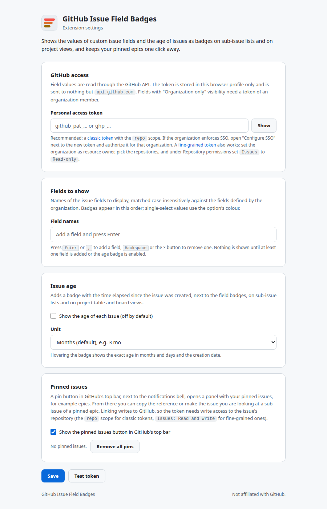

# GitHub Issue Field Badges

[Documentation site](https://milospaunovic.github.io/issue-field-badges/) · [Releases](https://github.com/MilosPaunovic/issue-field-badges/releases) · [Changelog](CHANGELOG.md) · [Privacy](PRIVACY.md)

Browser extension that shows the values of your organization's custom GitHub **issue fields** as badges on every row of the **Sub-issues** list of an issue and on **Projects** views (table and board), plus the **age** of each issue. A small **Pinned issues** panel keeps your epics one click away so you can link the issue you are looking at to them. Works in Chrome, Edge, Brave and other Chromium browsers, and in Firefox.

GitHub itself only shows the issue type there. This extension reads the field values through the GitHub GraphQL API, in batched queries covering all visible rows, across repositories. Everything is read-only except the optional linking of an issue to a pinned epic, which writes through the same API.

## Features

- Badges appear next to the issue type on each sub-issue row, in the option's colour.
- The same badges appear on GitHub Projects views: after the issue number in the table layout, under the title on board cards.
- An optional **age** badge shows how old each issue is, in months (`3 mo`), weeks or days. Off by default.
- A **Pinned issues** button in GitHub's top bar: pin epics, copy their reference, or make the issue you are looking at a sub-issue of a pinned epic with one click. Can be switched off in the settings.
- Any field type works: single-select, multi-select, text, number, date.
- Choose which fields to show and in what order; nothing is shown until you pick at least one field or enable the age badge.
- One API request per page, results cached for five minutes, no polling.
- Light and dark theme, follows GitHub's own colour tokens.
- No analytics, no third-party services. See [PRIVACY.md](PRIVACY.md).

## Install

The extension is plain files with no build step, so "installing from source" means pointing the browser at the folder. It runs in every Chromium-based browser and in Firefox.

### Chrome, Edge, Brave, Opera, Vivaldi, Arc (Chromium)

1. Clone or download this repository.
2. Open the extensions page: `chrome://extensions` (Edge: `edge://extensions`, Brave: `brave://extensions`, Opera: `opera://extensions`, Vivaldi: `vivaldi://extensions`) and enable **Developer mode**.
3. Click **Load unpacked** and select the repository folder.
4. Click the toolbar icon (or Details > Extension options) to open the settings.

### Firefox

Firefox does not run extension service workers and treats site access as an optional permission, so it uses its own manifest (`manifest.firefox.json`) and asks once for access to `github.com`.

1. Run `scripts/package.sh` to build `github-issue-field-badges-<version>-firefox.zip`, or download it from the releases page.
2. Open `about:debugging#/runtime/this-firefox`, click **Load Temporary Add-on**, and pick the zip. Temporary add-ons are removed when Firefox restarts; a permanent install needs a package signed by Mozilla.
3. Open the settings from the toolbar icon. If a **Site access** box is shown, click **Allow access to github.com**. Firefox may also show the request on the extensions (puzzle) button.

Minimum version: Firefox 140, required by the `data_collection_permissions` manifest key.

### Other browsers

- **Safari** needs Apple's `xcrun safari-web-extension-converter`, an Xcode project, and an Apple developer account. Not provided.
- Any other browser that implements Manifest V3 WebExtensions should work with one of the two manifests; the code uses the `browser` namespace when present and falls back to `chrome`.

## Setup

1. Create a GitHub personal access token:
   - **Classic** (recommended): https://github.com/settings/tokens/new with the `repo` scope. If the organization enforces SSO, click "Configure SSO" next to the new token and authorize it for the organization.
   - **Fine-grained**: https://github.com/settings/personal-access-tokens/new. Set the organization as resource owner, pick the repositories, and under Repository permissions set `Issues` to `Read-only` (or `Read and write` if you want to link issues to pinned epics from the panel).
2. Paste the token on the settings page, click **Test token**, then **Save**.
3. Add the **Field names** to show: each field is a chip, press Enter or comma to add one, Backspace or the × button to remove one. Names are matched case-insensitively. No badges appear until at least one field is added or the age badge is enabled.
4. Optionally enable the **Issue age** badge (off by default) and pick its unit, and decide whether you want the **Pinned issues** button in GitHub's top bar (on by default).
5. Open any issue with sub-issues, or a project view such as `https://github.com/orgs/<org>/projects/<n>/views/<v>`.

### Pinned issues

A pin button sits in GitHub's top bar, next to the notifications bell, with the number of pinned issues. It opens the pinned issues panel as a dropdown; clicking outside or pressing Escape closes it, and the open or closed state is per tab. On pages without the GitHub header a small floating pin button in the top right corner takes its place. A red dot on the button means the last request failed (for example no token yet); open the panel to read the message. The whole feature can be switched off in the settings.

- **Pin it** pins the issue you are looking at: the current issue page, or the item open in the project side panel. You can also paste an issue URL or `owner/repo#123` and press **Pin**.
- Each pin shows its type (for example `Epic`) and title, and has three actions: **Link** makes the current issue a sub-issue of the pin (asks before moving an issue that already has a different parent), **Copy** copies `owner/repo#123` to the clipboard, and **×** unpins it.
- Pins are stored locally in the browser and shared across tabs. The settings page can remove them all.

Linking calls GitHub's `addSubIssue` mutation and needs a token with write access to the issue's repository. Classic tokens with the `repo` scope have it; fine-grained tokens need `Issues: Read and write`.

Fields with "Organization only" visibility are returned only for tokens that belong to an organization member.

The token is stored with `chrome.storage.local` on your device and is only ever sent to `https://api.github.com/graphql`.

## How it works

- `content.js` watches the page for sub-issue lists, project table rows (`role="rowheader"` cells) and board cards, collects the issue links, and asks the background script for the field values and creation dates.
- `background.js` groups the issues by repository and runs one GraphQL query per batch of 60 issues using `Issue.issueFieldValues` and `createdAt`, then returns only the configured fields. Without a token or without anything to show it answers with a hint that `content.js` shows above the sub-issues list or in the pins panel. It also resolves pinned issues (title, type) and runs the `addSubIssue` mutation. It runs as a service worker on Chromium and as an event page on Firefox.
- `content.js` renders a badge per value after the issue type badge (or after the issue number in project tables, under the title on board cards), plus the age badge, styled by `content.css` with GitHub's colour tokens. It also renders the pinned issues panel; the current issue is taken from the page URL or from the `issue=owner|repo|number` parameter GitHub adds when a project side panel is open.
- `options.html` / `options.js` provide the settings page, including the one-time site-access prompt Firefox needs.
- All scripts start with `const api = browser ?? chrome`, so the same code runs on both engines.

## Development

No build step. Edit the files, then reload the extension (Chromium: reload icon on the extension card; Firefox: **Reload** on `about:debugging`).

- `manifest.json` is the Chromium manifest, `manifest.firefox.json` the Firefox one. Keep them in sync except for the `background` and `browser_specific_settings` keys.
- `python3 scripts/make-icons.py` regenerates the icons, dark tiles for the manifests and light tiles for the settings page and the docs site (needs Pillow).
- `scripts/package.sh` builds two zips one level above the repo (or into `OUT_DIR`): `github-issue-field-badges-<version>-chrome.zip` for Chromium browsers and `github-issue-field-badges-<version>-firefox.zip` for Firefox. Pass a `.pem` path as the first argument to also build a signed `.crx` for Chromium. Keep the key outside the repository; `.gitignore` excludes `*.pem`, `*.crx` and `*.zip`.

### Releasing

Releases are cut by pushing a tag:

1. Bump `version` in `manifest.json` and `manifest.firefox.json`, and move the `Unreleased` notes in [CHANGELOG.md](CHANGELOG.md) under the new version.
2. Commit, then tag and push: `git tag v1.1.0 && git push origin main v1.1.0`.

The `release` workflow (`.github/workflows/release.yml`) checks that the tag matches the manifest version, builds both zips with `scripts/package.sh`, and publishes a GitHub release with the zips attached and the matching changelog section as notes. Built packages are never committed.

## Documentation site

`docs/index.html` is a single-page site (no build step) describing what the extension does, how it works, and how to set it up. It is served by GitHub Pages from the `docs/` folder: in the repository settings open **Pages**, choose **Deploy from a branch**, branch `main`, folder `/docs`, save. The site is available at https://milospaunovic.github.io/issue-field-badges/. Its screenshots are the same `docs/settings-*.png` files used in this README.

## License

[MIT](LICENSE). Not affiliated with or endorsed by GitHub.
